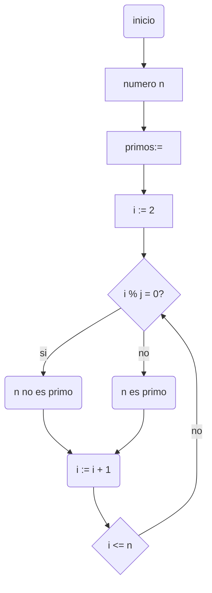
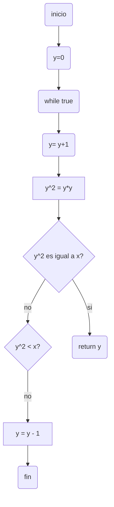

# RETO-3
## Algoritmo para encontrar numero primo hasta n 
diagrama de flujo:


Este es el pseudocodigo
```pseudocode
var i, j, primos: entero
  primos := []
  inicio
  i:= 2 
  mientras i <= n hacer
  para j := 2 hasta i - 1 hacer
      si i % j = 0 entonces
      sal
      fin_si
    fin_para
 // Si el número es primo, se agrega a la lista (i)
       i := i + 1
  fin_mientras
  fin
  ```
## Algoritmo para raices cuadradas
diagrama de flujo:

```pseudocodigo
def raíz_cuadrada(x):
  y = 0
  while True:
    y = y + 1
    y2 = y * y
    if y2 == x:
      return y
    elif y2 < x:
      return y
    else:
      y = y - 1
```
